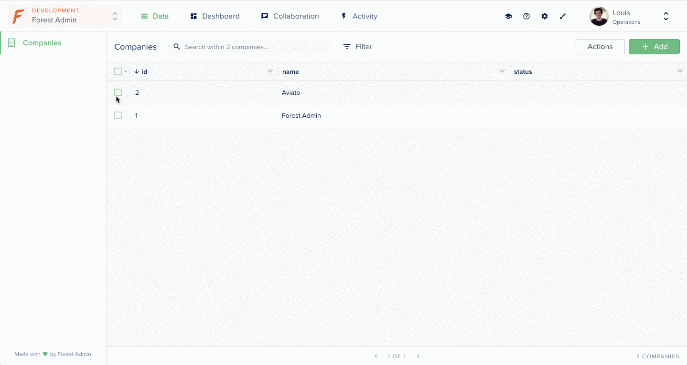

# Display a customized response

This example shows you how to display a different response following a smart action based on the number of records selected:

* if the action is done on one company, the response is `"Company is now live!"`
* if the action is done on several company, the response is `"Companies are now live!"`



## Requirements

* An admin backend running on forest-express-sequelize

## How it works

### Directory: /models

This directory contains the `companies.js` file where the model is declared.


```javascript
module.exports = (sequelize, DataTypes) => {
  const { Sequelize } = sequelize;
  const Companies = sequelize.define('companies', {
    name: {
      type: DataTypes.STRING,
    },
    status: {
      type: DataTypes.STRING,
    }
  }, {
    tableName: 'companies',
    timestamps: false,
    schema: process.env.DATABASE_SCHEMA,
  });


  return Companies;
};
```


### Directory: /forest

This directory contains the `companies.js` file where the Smart Action `Mark as Live`is declared.

```javascript
const { collection } = require('forest-express-sequelize');

collection('companies', {
  actions: [{
    name: 'Mark as Live',
    type: 'bulk',
  }],
});
```

### **Directory: /routes**

This directory contains the `companies.js` file where the implementation of the route is handled. The `POST /forest/actions/mark-as-live` API call is triggered when you click on the Smart Action in the Forest UI. 

```javascript
//...
const { RecordsGetter } = require('forest-express-sequelize');

router.post('/actions/mark-as-live', (req, res) => {
  return new RecordsGetter(companies).getIdsFromRequest(req)
    .then((companyIds) => {
      const companiesCount = companyIds.length;
      return companies
        .update({ status: 'live' }, { where: { id: companyIds }})
        .then(() => {
          const message = companiesCount > 1 ? 'Companies are now live!' : 'Company is now live!';
          res.send({ success: message });
        });
    });
});

//...
```

