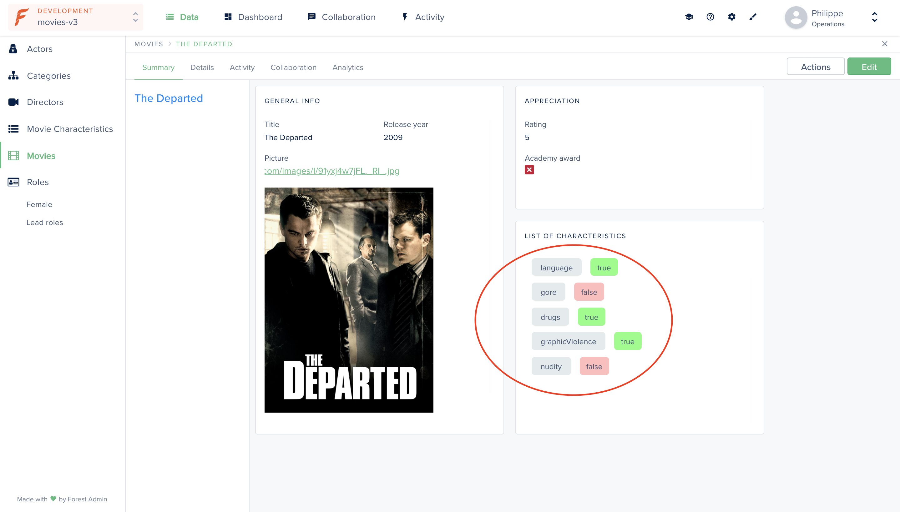

# Display data in html format

This example shows you how to implement a smart field that displays HTML.



  
  
Here a **Movie** `hasOne` **movieCharacteristic**.   
  
On the `movies` collection, we want to implement a smart field \(called `characteristics`\) that will display all the characteristics of a movie.


## Requirements

* An admin backend running on forest-express-sequelize

## How it works

### Directory: /models

This directory contains the `movies.js` and `movie-characteristics.js` files where the models **movies** and **movieCharacteristics** are defined. 



```javascript
module.exports = (sequelize, DataTypes) => {
  const { Sequelize } = sequelize;

  const Movies = sequelize.define('movies', {
    title: {
      type: DataTypes.STRING,
    },
    releaseYear: {
      type: DataTypes.INTEGER,
    },
    rating: {
      type: DataTypes.INTEGER,
    },
    picture: {
      type: DataTypes.STRING,
    },
    academyAward: {
      type: DataTypes.BOOLEAN,
    },
  }, {
    tableName: 'movies',
    underscored: true,
    timestamps: false,
    schema: process.env.DATABASE_SCHEMA,
  });

  Movies.associate = (models) => {
    Movies.hasOne(models.movieCharacteristics, {
      foreignKey: {
        name: 'movieIdKey',
        field: 'movie_id',
      },
      as: 'movieCharacteristic',
    });
  };

  return Movies;
};

```



```javascript
module.exports = (sequelize, DataTypes) => {
  const { Sequelize } = sequelize;
  
  const MovieCharacteristics = sequelize.define('movieCharacteristics', {
    language: {
      type: DataTypes.BOOLEAN,
    },
    graphicViolence: {
      type: DataTypes.BOOLEAN,
    },
    nudity: {
      type: DataTypes.BOOLEAN,
    },
    drugs: {
      type: DataTypes.BOOLEAN,
    },
    gore: {
      type: DataTypes.BOOLEAN,
    },
  }, {
    tableName: 'movie_characteristics',
    underscored: true,
    timestamps: false,
    schema: process.env.DATABASE_SCHEMA,
  });

  MovieCharacteristics.associate = (models) => {
    MovieCharacteristics.belongsTo(models.movies, {
      foreignKey: {
        name: 'movieIdKey',
        field: 'movie_id',
      },
      as: 'movie',
    });
  };

  return MovieCharacteristics;
};

```



### Directory: /forest

This directory contains the `movies.js` file where the smart field `characteristics` is implemented. The smart field returns an html-formatted list of the movie characteristics as a string.


```javascript
const { collection } = require('forest-express-sequelize');
const sequelize = require('sequelize');
const models = require('../models');

collection('movies', {
  fields: [
    {
      field: 'characteristics',
      type: 'String',
      get: (movie) => {
        // check if the movie has a related characteristics record to return smtg or not
        if (movie.movieCharacteristic) {
          // list all your fields from the movieCharacteristics collection you want to display
          const characteristicsNameList = ['language', 'gore', 'drugs', 'graphicViolence', 'nudity'];
          // create empty string which will be filled with a div per field listed above - this string will be the value returned
          let characteristicsList = '';
          // add style that will be used to display the movie_characteristics info
          const characteristicsDivStyle = 'margin: 24px 0px; color: #415574';
          const characteristicsNameStyle = 'padding: 6px 16px; margin: 12px; background-color:#b5c8d05e; border-radius: 6px';
          const characteristicsValueStyleRed = 'padding: 6px 12px; background-color:#ff7f7f87; border-radius: 6px';
          const characteristicsValueStyleGreen = 'padding: 6px 12px; background-color:#7FFF7F; border-radius: 6px';
          // iterate over the list of movie characteristics fields
          for (index = 0; index < characteristicsNameList.length; index++) {
            const fieldName = characteristicsNameList[index];
            // check if the value of the field is 0 or 1 to add the relevant style (default is 0)
            let characteristicsValueStyle = characteristicsValueStyleRed;
            if (movie.movieCharacteristic[fieldName] === true) {
              characteristicsValueStyle = characteristicsValueStyleGreen;
            }
            // insert the div with the field info to the string that will be returned
            characteristicsList += `<div style="${characteristicsDivStyle}">
                <span style="${characteristicsNameStyle}">${fieldName}</span>
                <span style="${characteristicsValueStyle}">${movie.movieCharacteristic[fieldName]}</span>
              </div>`;
          }
          return characteristicsList;
        }
      },
    }
});

```


## In the Forest Admin UI

You will need to select the [rich text editor widget](https://docs.forestadmin.com/documentation/reference-guide/fields/customize-your-fields/edit-widgets#rich-text-editor) for this field in your collection settings to display the string returned by the smart field in html format.


