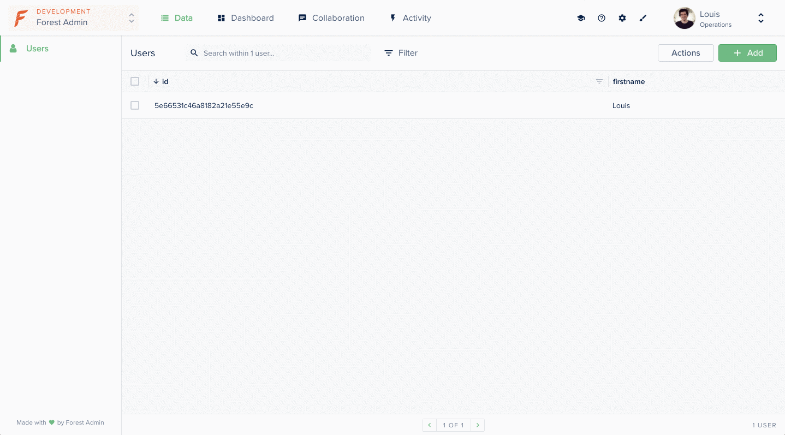

# Display/edit a nested document

This example shows you how to use a smart field to display and update a nested document.

Nested document in Forest Admin are not visible in the table view and are are displayed as a JSON in the details view. To make the document information more visible you can choose to display a smart field.



## Requirements <a id="requirements"></a>

* An admin backend running on forest-express-mongoose

## How it works

### Directory: /forest

This directory contains the `users.js` file where the Smart Field `fistname`is declared.


```javascript
const { collection } = require('forest-express-mongoose');

collection('users', {
  fields: [{
    field: 'firstname',
    type: 'String',
    // display the firstname
    get: (user) => {
      return user.person.firstname;
    },
    // edit the firstname
    set: ((user, value) => {
      if(!user.person) {
        user.person = {};
      }
      user.person.firstname = value
    })
  }],
});
```


### Directory: /models

This directory contains the file `users.js` where the model's definition had been generated by Forest Admin.


```javascript
const mongoose = require('mongoose');

const schema = mongoose.Schema({
  'person': {
    firstname: String,
    lastname: String,
    email: String,
  },
}, {
  timestamps: false,
});

module.exports = mongoose.model('users', schema, 'users');
```


