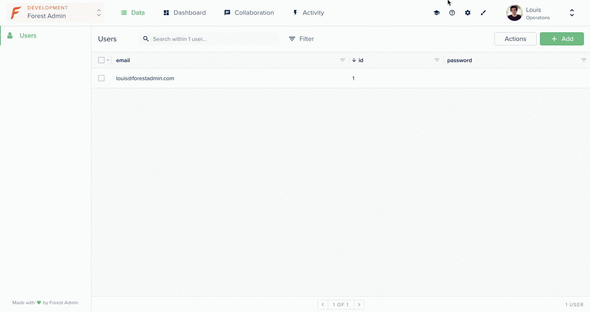

# Hash a password with bcrypt

This example shows you how to use [bcrypt](https://www.npmjs.com/package/bcrypt) to convert a password field into unreadable strings of characters.



## Requirements

* An admin backend running on forest-express-sequelize
* [bcrypt](https://www.npmjs.com/package/bcrypt) npm package

## How it works

### Directory: /models

This directory contains the `users.js` file where the model is declared.

In this example, we're using a [custom setter](https://sequelize.org/master/manual/getters-setters-virtuals.html#setters) for the password attribute of the `users` models.


```javascript
const bcrypt = require('bcrypt');

module.exports = (sequelize, DataTypes) => {
  const { Sequelize } = sequelize;

  const Users = sequelize.define('users', {
    email: {
      type: DataTypes.STRING,
    },
    password: {
      type: DataTypes.STRING,
      allowNull: true,
      // Storing passwords in plaintext in the database is terrible.
      // Hashing the value with an appropriate cryptographic hash function is better.
      set(value) {
        const hash = bcrypt.hashSync(value, 10);
        this.setDataValue('password', hash);
      },
    },
  }, {
    tableName: 'users',
    timestamps: false,
    schema: process.env.DATABASE_SCHEMA,
  });
```



The above example involving password handling, although much better than simply storing the password in plaintext, are far from perfect security. Handling passwords properly is hard, everything here is just for the sake of an example to show [Sequelize functionality](https://sequelize.org/master/manual/getters-setters-virtuals.html).


