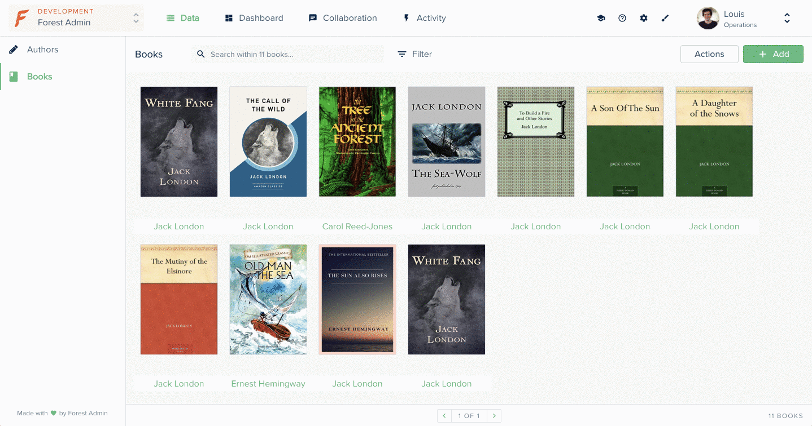

# Link to record info in a smart view

This example shows you how to redirect to:

* the detail view of a record
* the detail view of the associated record

in a smart view.

Here a **Book** `belongsTo` an **Author**. We will see how to redirect to the book detail view and author detail view from a book gallery view.



## Requirements

* An admin backend running on forest-express-sequelize

## How it works

### Directory: /models

This directory contains the `books.js` and `authors.js` files where the models are defined. 




```javascript
module.exports = (sequelize, DataTypes) => {
  const { Sequelize } = sequelize;

  const Books = sequelize.define('books', {
    attributes: {
      type: DataTypes.JSONB,
    },
  }, {
    tableName: 'books',
    timestamps: false,
    schema: process.env.DATABASE_SCHEMA,
  });

  Books.associate = (models) => {
    Books.belongsTo(models.authors, {
      foreignKey: {
        name: 'authorIdKey',
        field: 'authorId',
      },
      as: 'author',
    });
  };

  return Books;
};
```





```javascript
module.exports = (sequelize, DataTypes) => {
  const { Sequelize } = sequelize;

  const Authors = sequelize.define('authors', {
    name: {
      type: DataTypes.STRING,
    },
  }, {
    tableName: 'authors',
    timestamps: false,
    schema: process.env.DATABASE_SCHEMA,
  });

  return Authors;
};
```




### File: template.hbs

This file contains handlebars and HTML declaration.

```markup
template.hbs

<style>
  .l-gallery-view-container {
    flex-grow: 1;
    width: 100%;
    height: 100%;
    overflow: hidden;
    position: relative;
  }

  .c-gallery {
    padding: 15px;
    overflow-y: auto;
    width: 100%;
    position: absolute;
    left: 0;
    top: 0;
    bottom: 40px;
    display: flex;
    flex-direction: row;
    flex-wrap: wrap;
  }

  .c-gallery__image {
    height: 197px;
    width: 138px;
    margin: 10px;
    border: 1px solid var(--color-beta-on-surface_border);
    border-radius: 2px;
    transition: all .3s ease-out;
  }

  .c-gallery__image:hover {
    transform: scale(1.05);
  }

  .l-gallery-book-container {
    position: relative;
  }

  .c-gallery__author {
    position: absolute;
    left: 0;
    right: 0;
    bottom: 8px;
    padding: 2px 4px;
    border-radius: 2px;
    background-color: var(--color-beta-surface);
    text-align: center;
    align-items: center;
  }
</style>

<div class="l-gallery-view-container">
  <section class="c-gallery">
    {{#each @records as |record|}}
      <div class="l-gallery-book-container">
        <!-- redirect to book detail view -->
        <LinkTo
          @route="rendering.data.collection.list.viewEdit.details"
          @models={{array @collection.id record.id}}
          class="c-gallery__image-container"
        >
          
        </LinkTo>
        
        <!-- redirect to author detail view -->
        <BetaLinkTo
          @type="primary"
          @size="normal"
          @underline={{false}}
          @text={{record.forest-author.forest-name}}
          @routeName="rendering.data.collection.list.viewEdit.details"
          @routeParameters={{array this.authorCollectionId record.forest-author.id}}
          @class="c-gallery__author"
        />
      </div>
    {{/each}}
  </section>
  
  <Table::TableFooter
    @collection={{@collection}}
    @viewList={{@viewList}}
    @records={{@records}}
    @currentPage={{@currentPage}}
    @numberOfPages={{@numberOfPages}}
    @recordsCount={{@recordsCount}}
    @isLoading={{@isLoading}}
    @fetchRecords={{@fetchRecords}}
  />
</div>
```

### File: javascript.js

This file handle all events or actions

```javascript
component.js

import Component from '@ember/component';
import { computed } from '@ember/object';
import SmartViewMixin from 'client/mixins/smart-view-mixin';
​
export default Component.extend(SmartViewMixin, {
  tagName: '',

  authorCollectionId: computed(function () {
    return this.getCollectionId('authors');
  }),
});
```

