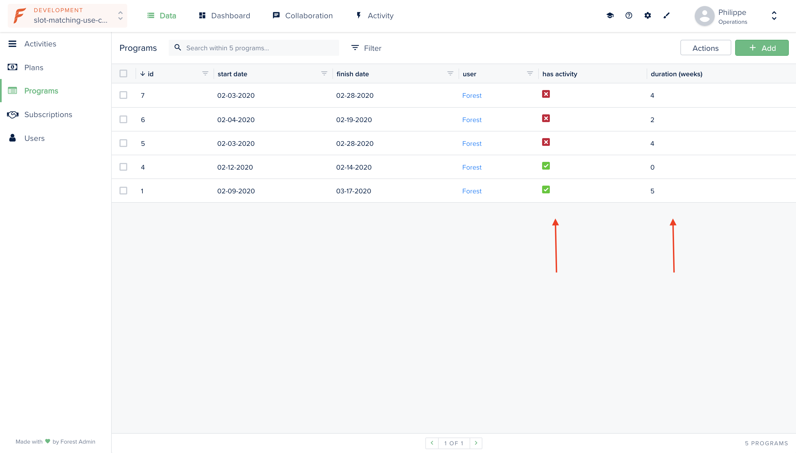

# Load smart fields using hook

This example shows you how to implement an afterFind hook with Sequelize to load several smart fields at once when a record is retrieved from the database. Learn more about [Sequelize hooks](https://sequelize.org/master/manual/hooks.html).

The main advantage of using an afterFind hook is that it allows you to avoid multiplying queries to your database if those queries are redundant when retrieving smart fields values.  
  
Here a **Program** `hasMany` **Activities**.   
  
We want to display two smart fields:  

* `"hasActivity"`, that will return whether the program has any related activities in the database.
* `"duration"`, that will return the length of the program in weeks.



## Requirements

* An admin backend running on forest-express-sequelize

## How it works

### Directory: /models

This directory contains the `programs.js` file where the model is declared. 

As Sequelize hooks are declared upon the model definition, the afterFind hook is implemented in this file.



```javascript
function calculateNumberOfWeek({ startDate, finishDate }) {
  const diff = startDate - finishDate;
  const diffInWeeks = (diff / (1000 * 60 * 60 * 24 * 7));
  return Math.abs(Math.round(diffInWeeks));
}

module.exports = (sequelize, DataTypes) => {
  const { Sequelize } = sequelize;
   const Programs = sequelize.define('programs', {
    startDate: {
      type: DataTypes.DATE,
    },
    finishDate: {
      type: DataTypes.DATE,
    },
    description: {
      type: DataTypes.STRING,
    },
  }, {
    tableName: 'programs',
    underscored: true,
    timestamps: false,
    schema: process.env.DATABASE_SCHEMA,
    hooks: {
      afterFind: async (programs) => {
        // Check if several records have been fetched or a single one
        const isFindOne = !programs.length;
        if (isFindOne) { programs = [programs]; }
        const recordsIds = programs.map(record => record.id);
        const activities = await sequelize.models.activities.findAll({
          where: { programIdKey: recordsIds },
        });

        programs.forEach((program) => {
          program.duration = calculateNumberOfWeek(program);
          program.hasActivity = activities.some(activity => activity.programIdKey === program.id);
        });

        return isFindOne ? programs[0] : programs;
      },
    },
  });
```



### Directory: /forest

This directory contains the `programs.js` file where the smart fields `duration` and `hasActivity` are declared. 


As the logic to retrieve the field value is defined in the hook, you do not need to define the get method for each smart field.



```javascript
const { collection } = require('forest-express-sequelize');

collection('programs', {
  actions: [],
  fields: [
    {
      field: 'duration',
      type: 'Number',
    }, {
      field: 'hasActivity',
      type: 'Boolean',
    }
  ],
  segments: [],
});
```



