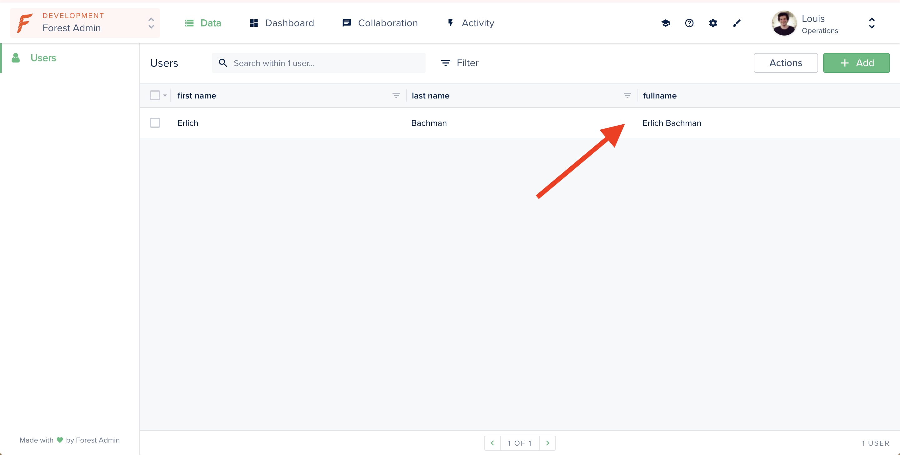

# Re-use a smart field logic

This example shows you how to re-use the logic of your smart field.

Here, we created a `fullname` field that concatenates first and last name. We'll create our own function and export it for use elsewhere in our admin backend.



## Requirements

* An admin backend running on forest-express-sequelize

## How it works

### Directory: /models

This directory contains the `users.js` where the model is defined. 


```javascript
module.exports = (sequelize, DataTypes) => {
  const { Sequelize } = sequelize;

  const Users = sequelize.define('users', {
    firstName: {
      type: DataTypes.STRING,
    },
    lastName: {
      type: DataTypes.STRING,
    },
  }, {
    tableName: 'users',
    timestamps: false,
    schema: process.env.DATABASE_SCHEMA,
  });

  return  Users;
};
```


### Directory: /forest

This directory contains the `users.js` file where the Smart Field `fullname`is declared.

```javascript
const { collection } = require('forest-express-sequelize');

// create our own module
const getFullname = (user) => {
  return `${user.firstName} ${user.lastName}`;
};


collection('users', {
  fields: [{
    field: 'fullname',
    type: 'String',
    get: getFullname,
  }],
});

// export it to use it somewhere else in our admin backend
module.exports = {
  getFullname,
};
```


You can now require this module everywhere in your admin backend:

```text
const { getFullname } = require('../forest/user');
```


