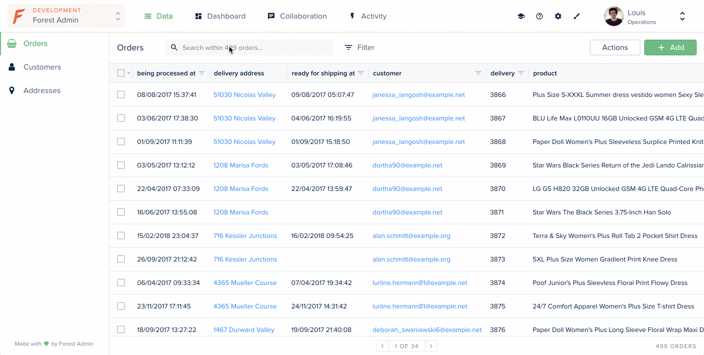

# Search on a smart field with joints

This example shows you how to search on a smart field to display a belongsTo smart relationship.  
  
We have an **order** which `belongsTo` a **customer** which `belongsTo` a **delivery address**. We’ve created here a BelongsTo Smart Relationship that acts like a shortcut between the **order** and the **delivery address**.



## Requirements

* An admin backend running on forest-express-sequelize

## How it works

### Directory: /models

This directory contains the `orders.js` , `customers.js` and `addresses.js` files where the models are declared.



```javascript
module.exports = (sequelize, DataTypes) => {
  const { Sequelize } = sequelize;
  const Orders = sequelize.define('orders', {
    ...
  }, {
    tableName: 'orders',
    underscored: true,
    schema: process.env.DATABASE_SCHEMA,
  });

  Orders.associate = (models) => {
    Orders.belongsTo(models.customers, {
      foreignKey: {
        name: 'customerId',
        field: 'customer_id',
      },
      as: 'customer',
    });
  };

  return Orders;
};
```



```javascript
module.exports = (sequelize, DataTypes) => {
  const { Sequelize } = sequelize;
  const Customers = sequelize.define('customers', {
    ...
  }, {
    tableName: 'customers',
    underscored: true,
    schema: process.env.DATABASE_SCHEMA,
  });

  Customers.associate = (models) => {
    Customers.hasMany(models.orders, {
      foreignKey: {
        name: 'customerId',
        field: 'customer_id',
      },
      as: 'orders',
    });
    Customers.hasOne(models.addresses, {
      foreignKey: {
        name: 'customerId',
        field: 'customer_id',
      },
      as: 'addresses',
    });
  };

  return Customers;
};
```



```javascript
module.exports = (sequelize, DataTypes) => {
  const { Sequelize } = sequelize;
  const Addresses = sequelize.define('addresses', {
    addressLine1: {
      type: DataTypes.STRING,
      field: 'address_line_1',
    },
    ...
  }, {
    tableName: 'addresses',
    underscored: true,
    schema: process.env.DATABASE_SCHEMA,
  });

  Addresses.associate = (models) => {
    Addresses.belongsTo(models.customers, {
      foreignKey: {
        name: 'customerId',
        field: 'customer_id',
      },
      as: 'customer',
    });
  };

  return Addresses;
};
```



### Directory: /forest

This directory contains the `orders.js` file where the BelongsTo Smart Relationship `delivery_address`is declared.  
  
A belongsTo Smart Relationship is created like a Smart Field with the `reference` option to indicates on which collection the Smart Relationship points to.  
  
As for Smart Field, the search is not supported by default. So we'll have to implement the logic using [Sequelize querying methods](https://sequelize.org/master/manual/model-querying-basics.html).


```javascript
const models = require('../models');
const { Op } = models.Sequelize;

collection('orders', {
  fields: [{
    field: 'delivery_address',
    type: 'String',
    reference: 'addresses.id',
    // display the belongsTo Smart Relationship
    get: function (order) {
      return models.addresses
        .findAll({
          include: [{
            model: models.customers,
            as: 'customer',
            where: { id: order.customerId },
            include: [{
              model: models.orders,
              as: 'orders',
              where: { ref: order.ref }
            }]
          }],
        })
        .then((addresses) => {
          if (addresses) { return addresses[0]; }
        });
    },
    // search on the belongsTo Smart Relationship
    search(query, search) {
      query.include.push({
        model: models.customers,
        as: 'customer',
        include: [{
          model: models.addresses,
          as: 'addresses',
        }],
      });
      query.where[Op.and][0][Op.or]
        .push(models.sequelize.literal(`"customer->addresses".address_line_1 ILIKE '%${search}%'`));
    }
  }],
});
```


