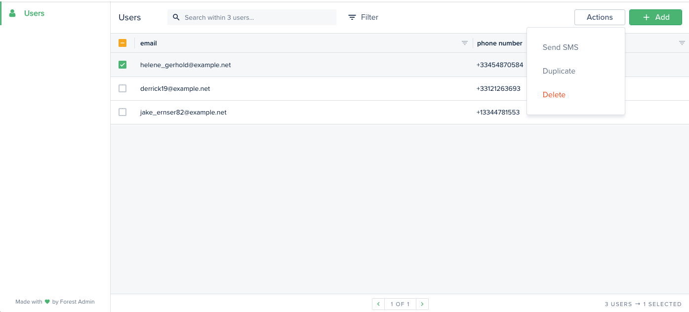

# Trigger a webhook with Zapier

This example shows you how to create a Smart Action "Send SMS" that triggers a [Zapier webhook](https://zapier.com/zapbook/webhook/) to send an SMS message with Twilio.



## Requirements

* An admin backend runing on forest-express-sequelize
* A Zapier account
* [node-fetch](https://www.npmjs.com/package/node-fetch) npm package

## How it works

### **File: forest/users.js**

This file contains the Smart Action declaration `Send SMS`.


```javascript
const { collection } = require('forest-express-sequelize');

collection('users', {
  actions: [{
    name: 'Send SMS',
    type: 'single'
  }],
});
```


### **File: routes/users.js**

This file contains the implementation of the route that handled the `POST /forest/actions/send-sms` API call when you click on the Smart Action in the Forest UI. The route implementation retrieves all the necessary data and triggers another API call directly to a [Zapier hook](https://zapier.com/zapbook/webhook/).


```javascript
const fetch = require('node-fetch');
...

// Send SMS
router.post('/actions/send-sms', (request, response) => {
  let userId = request.body.data.attributes.ids[0];
  return users
    .findByPk(userId)
    .then((user) => {
      user = user.toJSON()
      return fetch('https://hooks.zapier.com/hooks/catch/4760242/o1uqz0r/silent', {
        method: 'POST',
        body: JSON.stringify({
          phoneNumber: user.phoneNumber
        }),
        headers: { 'Content-Type': 'application/json' },
      });
    })
    .then(() => {
      response.status(204).send();
    });
});

...

module.exports = router;
```


### File: models/users.js

This file contains the users model generated automatically by Forest Admin.


```javascript
module.exports = (sequelize, DataTypes) => {
  const { Sequelize } = sequelize;
  const Users = sequelize.define('users', {
    email: {
      type: DataTypes.STRING,
    },
    phoneNumber: {
      type: DataTypes.STRING,
    },
  }, {
    tableName: 'users',
    timestamps: false,
    schema: process.env.DATABASE_SCHEMA,
  });

  Users.associate = (models) => {
  };

  return Users;
};
```


