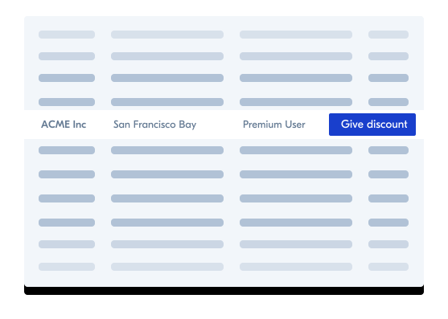

# What is it

**What is it?**

A smart action is a button which allows you to trigger a custom business command through **an API call to your servers**.

**What For?**

Implement your very own business logic behind any button, extending Forest Admin’s integration in your day-to-day operations.

