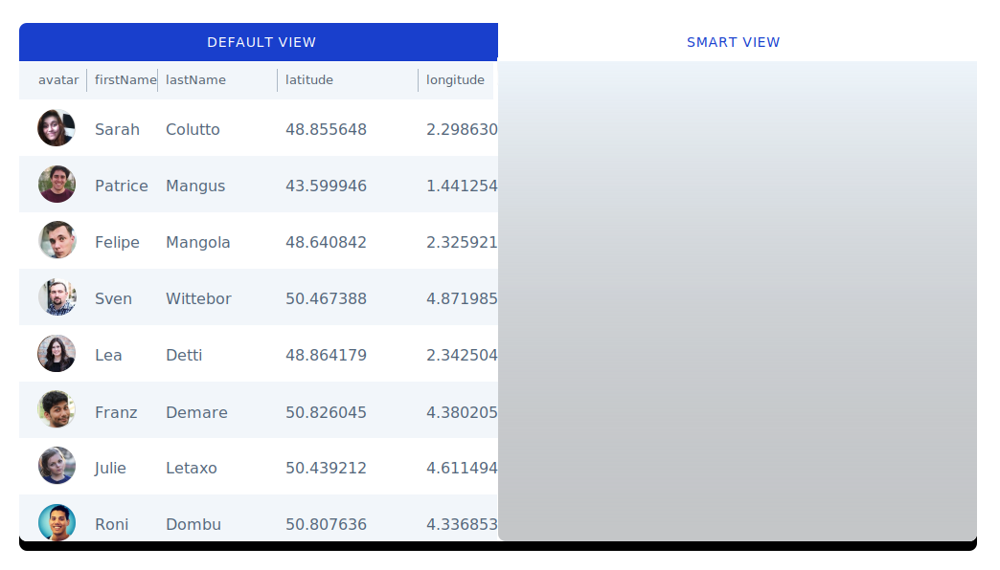

# What is it

**What is it?**

By default, Forest renders your data using a table view when accessing multiple records. Businesses with very specific processes may need to display their records in a custom view to browse through their data efficiently. Smart Views let you **code your own views using JS, HTML and CSS** and tailor your interface to your specific business needs.

**What For?**

Ditch the table view and display your orders on a Map, your events in a Calendar or simply design your own custom view. All of this is made easy by Forest.

